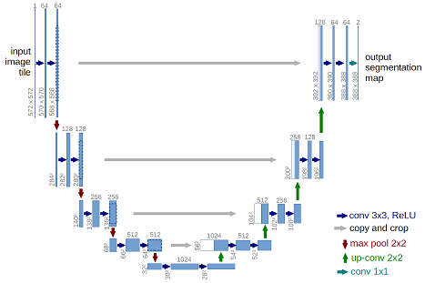

# Implementation of deep learning framework -- Unet, using Keras

> **This work is an extension of [https://github.com/zhixuhao/unet](https://github.com/zhixuhao/unet).**

The architecture was inspired by [U-Net: Convolutional Networks for Biomedical Image Segmentation](http://lmb.informatik.uni-freiburg.de/people/ronneber/u-net/).

---

## Overview

### Data

The original dataset is from [isbi challenge](http://brainiac2.mit.edu/isbi_challenge/), and I've downloaded it and done the pre-processing.

You can find it in folder data/membrane.

### Data augmentation

The data for training contains 30 512*512 images, which are far not enough to feed a deep learning neural network. I use a module called ImageDataGenerator in keras.preprocessing.image to do data augmentation.

See dataPrepare.ipynb and data.py for detail.

### Model



This deep neural network is implemented with Keras functional API, which makes it extremely easy to experiment with different interesting architectures.

Output from the network is a 512*512 which represents mask that should be learned. Sigmoid activation function
makes sure that mask pixels are in \[0, 1\] range.

### Training

The model is trained for 5 epochs.

After 5 epochs, calculated accuracy is about 0.97.

Loss function for the training is basically just a binary crossentropy.

---

## How to use

### Dependencies

This tutorial depends on the following libraries:

* Tensorflow
* Keras >= 1.0
* scikit-image
* numpy

Also, this code should be compatible with Python versions 3.x.

### Run main.py

You will see the predicted results of test image in data/membrane/test

### Or follow notebook trainUnet

---

## New Features and Improvements

- **This repository extends the original [zhixuhao/unet](https://github.com/zhixuhao/unet) with:**
    - Full training set evaluation (reproducing Table 2 metrics: Dice, Pixel error, Rand error)
    - Improved data handling (support for train/image and train/label subfolders)
    - Example code for evaluation and metrics calculation
    - More robust and modular code structure

### Example: Evaluate on Training Set

<!-- ```python
from skimage.metrics import adapted_rand_error

dice_scores = []
pixel_errors = []
rand_errors = []
for y_true, y_pred in zip(ground_truths, predictions):
    y_pred_bin = (y_pred > 0.5).astype(np.float32)
    y_true_bin = (y_true > 0.5).astype(np.float32)
    # Dice
    dice = dice_coef(y_true_bin, y_pred_bin).numpy()
    dice_scores.append(dice)
    # Pixel error
    pixel_error = 1 - pixel_accuracy(y_true_bin, y_pred_bin).numpy()
    pixel_errors.append(pixel_error)
    # Rand error
    are, _, _ = adapted_rand_error(
        y_true_bin.squeeze().astype(np.uint8),
        y_pred_bin.squeeze().astype(np.uint8)
    )
    rand_errors.append(are)
print("Mean Dice coefficient:", np.mean(dice_scores))
print("Mean Pixel error:", np.mean(pixel_errors))
print("Mean Rand error:", np.mean(rand_errors)) -->